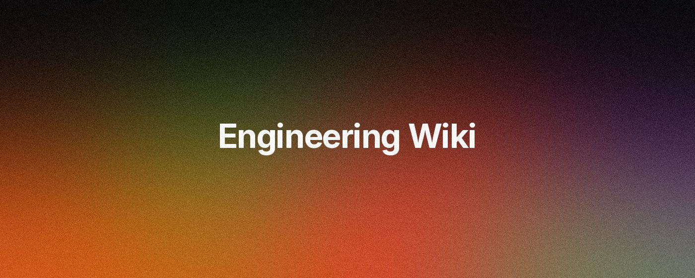
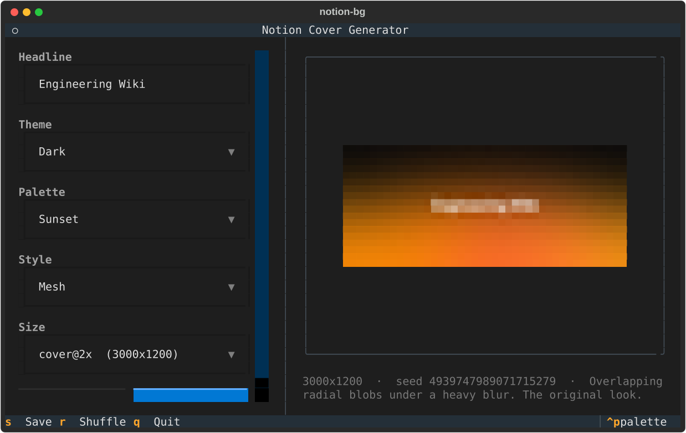
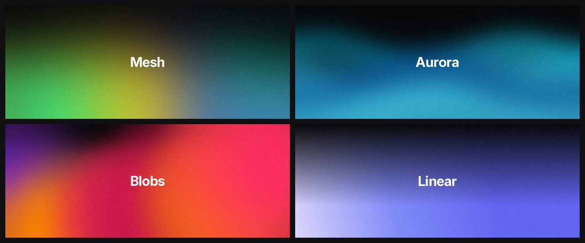
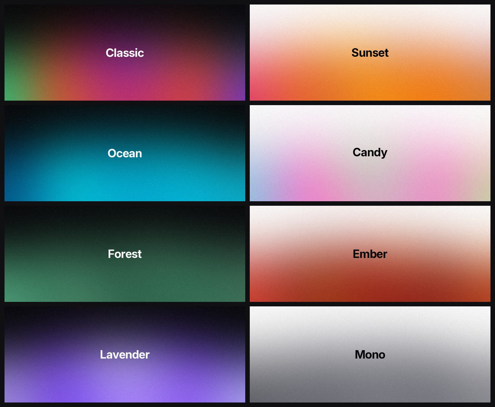
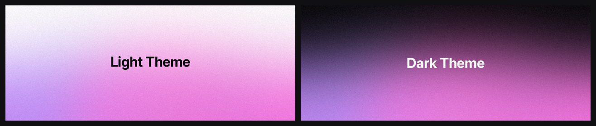

<div align="center">

# notion-bg-gen

**Mesh-gradient cover images for Notion pages, from a terminal UI or a one-line command.**

[](https://github.com/dj-skn/notion-bg-gen/actions/workflows/ci.yml)
[](https://pypi.org/project/notion-bg-gen/)
[](https://pypi.org/project/notion-bg-gen/)
[](https://pypi.org/project/notion-bg-gen/)
[](LICENSE)
[](https://github.com/astral-sh/ruff)
[](https://github.com/dj-skn/notion-bg-gen/stargazers)



</div>

---

## Try it without installing anything

If you have [uv](https://docs.astral.sh/uv/getting-started/installation/):

```bash
uvx notion-bg-gen
```

That opens the terminal UI. Type a title, press `s`, and the cover lands in `covers/`.

## Install it properly

| | |
|---|---|
| **macOS (recommended)** | `brew install dj-skn/tap/notion-bg` |
| **Any platform, with uv** | `uv tool install notion-bg-gen` |
| **Any platform, with pipx** | `pipx install notion-bg-gen` |
| **Plain pip** | `pip install notion-bg-gen` |
| **No Python at all** | [Download a binary](https://github.com/dj-skn/notion-bg-gen/releases/latest) |

Then run:

```bash
notion-bg
```

New to the terminal? The [installation guide](docs/installation.md) walks through
it one step at a time, including what to do when macOS says the download "cannot
be opened".

---

## The terminal UI

Running `notion-bg` with no arguments opens an interactive app. Everything
updates live, and the preview is the real renderer at a smaller size, so what
you see is what gets written.

<div align="center">

</div>

| Key | Action |
|---|---|
| `s` | Save the cover at full resolution |
| `r` | Shuffle - draw a new random layout |
| `q` | Quit |
| `Tab` | Move between fields |

---

## The command line

Every option in the UI is a flag, so covers can be generated in a script, a
Makefile, or a CI job.

```bash
# One cover, default look
notion-bg generate "Engineering Wiki"

# Pick a palette and a style
notion-bg generate "Roadmap" --palette ocean --style aurora

# A batch, reproducibly
notion-bg generate --from-file titles.txt --seed 7 --out ./covers

# Five variations to choose from
notion-bg generate "Design System" --count 5
```

### Commands

| Command | What it does |
|---|---|
| `notion-bg` | Open the terminal UI |
| `notion-bg generate [TEXT]...` | Generate one or more covers |
| `notion-bg palettes` | List palettes (`--json` for machine output) |
| `notion-bg styles` | List styles and sizes (`--json` too) |
| `notion-bg config edit` | Add your own palettes and themes |
| `notion-bg --help` | Full reference |

### Options

| Flag | Default | Notes |
|---|---|---|
| `--palette`, `-p` | `classic` | See `notion-bg palettes` |
| `--theme`, `-t` | `dark` | `dark` or `light` |
| `--style`, `-s` | `mesh` | `mesh`, `aurora`, `blobs`, `linear` |
| `--size` | `cover@2x` | Named size or `2000x800` |
| `--count`, `-n` | `1` | Covers per headline |
| `--out`, `-o` | `covers` | Output directory |
| `--format`, `-f` | `jpg` | `jpg`, `png`, `webp` |
| `--quality`, `-q` | `92` | JPEG and WebP quality |
| `--grain`, `-g` | `0.35` | Film grain, `0` to `1` |
| `--seed` | random | Same seed, same image |
| `--font` | bundled Inter Bold | Any `.ttf` or `.otf` |
| `--overwrite` | off | Replace instead of numbering |
| `--dry-run` | off | Report paths, write nothing |

---

## Styles



| Style | Look |
|---|---|
| `mesh` | Overlapping radial blobs under a heavy blur. The original. |
| `aurora` | Soft horizontal curtains with a sine warp. |
| `blobs` | Fewer, tighter, higher-contrast orbs. |
| `linear` | A clean multi-stop sweep. The restrained option. |

## Palettes



`classic`, `sunset`, `ocean`, `candy`, `forest`, `ember`, `lavender`, `mono` -
each usable on either theme. Add your own with `notion-bg config edit`.

## Themes



The headline colour is chosen for legibility. If a palette puts a dark field
behind dark text, the ink flips automatically so the title stays readable.
Override it with `--text-color` when you want the last word.

---

## Sizes

| Name | Pixels | Use |
|---|---|---|
| `cover` | 1500 x 600 | Notion's documented minimum |
| `cover@2x` | 3000 x 1200 | **Default.** The same band on a HiDPI screen |
| `wide` | 3840 x 1200 | Very wide layouts |
| `square` | 1200 x 1200 | Social cards and thumbnails |

Any `WIDTHxHEIGHT` works too, up to 10000px a side.

---

## Using it from a script or an agent

`generate` is built to be driven by something other than a human:

- `--json` puts a structured result on **stdout** and all progress on stderr
- `--seed` makes output byte-for-byte reproducible
- `--dry-run` reports the paths it would write
- `palettes --json` and `styles --json` make the options discoverable
- Exit codes are `0` success, `1` render failure, `2` bad input
- A bare `notion-bg` in a pipe or a CI job prints help and exits `2` rather
  than trying to open a full-screen UI

```bash
notion-bg generate "Release Notes" --seed 42 --json
```

```json
{
  "covers": [
    {
      "path": "covers/release-notes.jpg",
      "text": "Release Notes",
      "seed": 42,
      "palette": "classic",
      "theme": "dark",
      "style": "mesh",
      "width": 3000,
      "height": 1200,
      "format": "jpg",
      "written": true,
      "bytes": 1137482
    }
  ],
  "count": 1
}
```

More in the [automation guide](docs/automation.md).

---

## Your own palettes

```bash
notion-bg config edit
```

```toml
[palettes.brand]
name = "Brand"
description = "Our colours."
colors = ["#0F172A", "#1E40AF", "#3B82F6", "#93C5FD"]

[themes.midnight]
background = "#020617"
text = "#E2E8F0"
```

```bash
notion-bg generate "Internal Docs" --palette brand --theme midnight
```

---

## Documentation

- [Installation](docs/installation.md) - every platform, written for non-developers
- [Quickstart](docs/quickstart.md)
- [CLI reference](docs/cli.md)
- [Configuration](docs/configuration.md)
- [Automation and agents](docs/automation.md)
- [Contributing](CONTRIBUTING.md)
- [Changelog](CHANGELOG.md)

## Contributing

Issues and pull requests are welcome. [CONTRIBUTING.md](CONTRIBUTING.md) covers
the setup, which is `uv sync` and `pytest`.

## License

[MIT](LICENSE).

The bundled [Inter](https://rsms.me/inter/) typeface is used under the
[SIL Open Font License 1.1](https://openfontlicense.org/).
